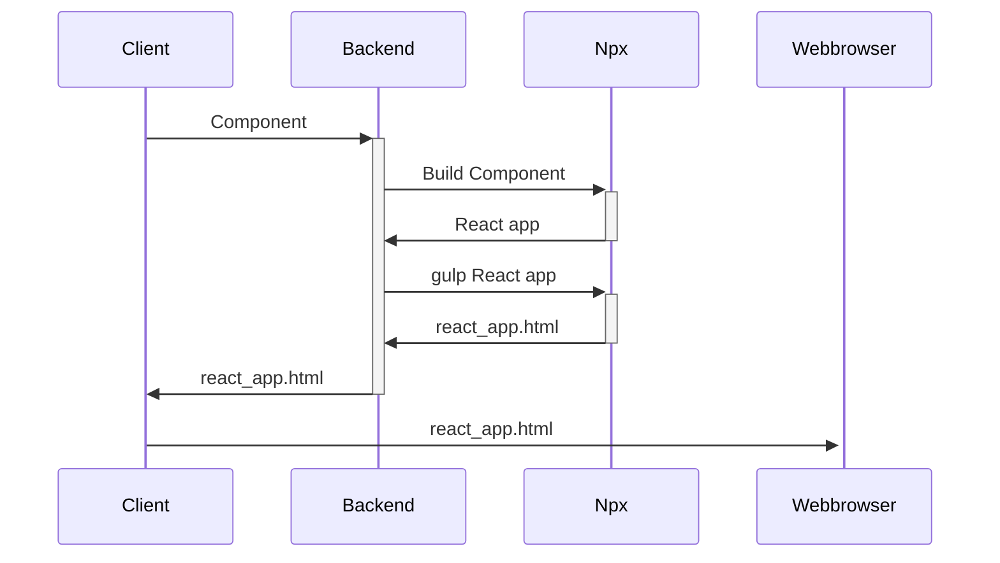

# UML

```mermaid
sequenceDiagram
    Client->>+Backend: Component 
    Backend->>+Npx: Build Component
    Npx->>-Backend: React app
    Backend->>+Npx: gulp React app
    Npx->>-Backend: react_app.html
    Backend->>-Client: react_app.html
    Client->>+Webbrowser: react_app.html
```