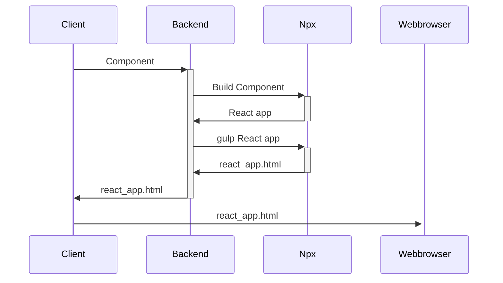
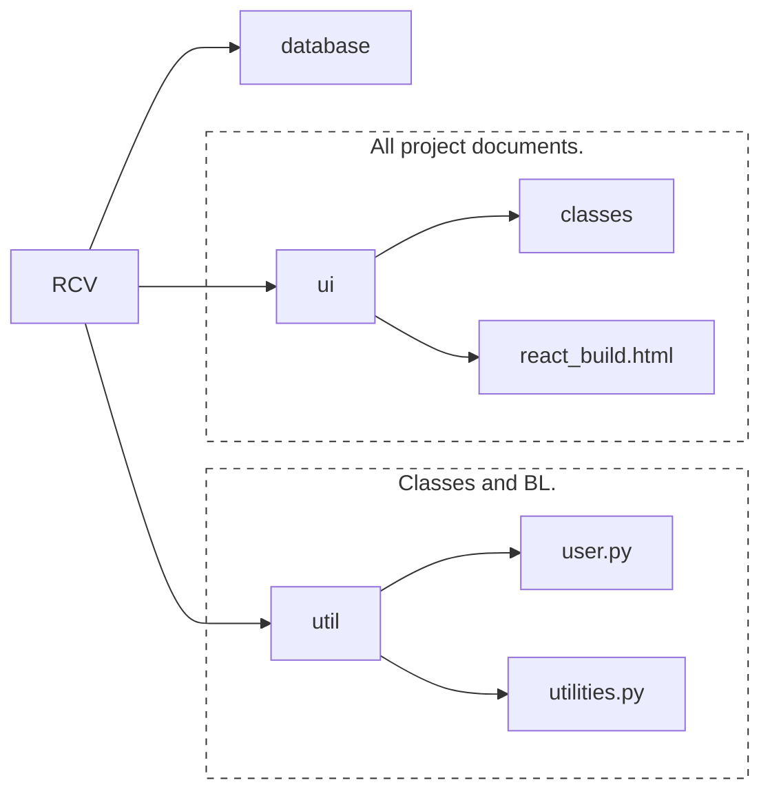
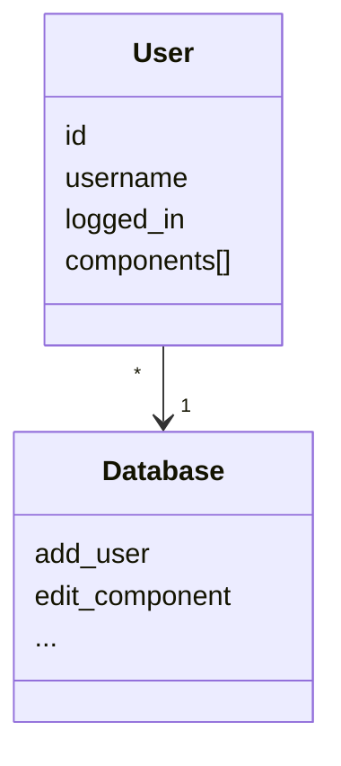
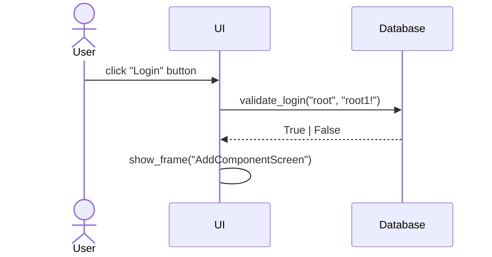
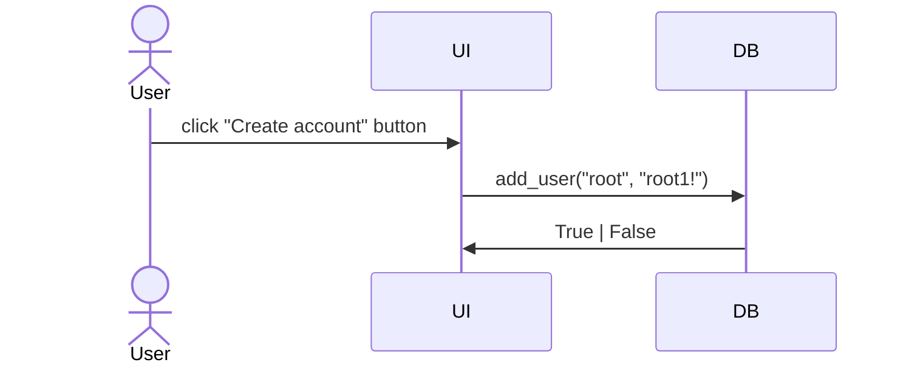
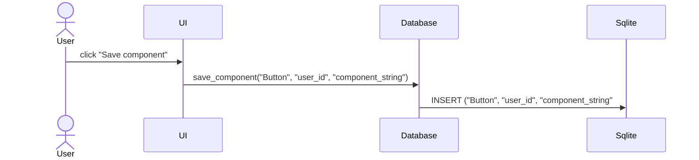

# UML

## Sequence diagram

# Arkkitehtuurikuvaus

## Composition

ReactComponentViewer is composed of three main layers

The ui package contains the frames (omitting the main frame, which is initialized in index.py). Utilities contain business logic, utility functions and the user class. The singular database.py file contains all interactions with the database (sqlite3).

## UI

The UI consists of three main screens:

- Log in / Register
- Your component / community components
- Add new component

Each of the scenes have been implemented as a separate class. The UI layer only implements the functions essential to its appearance. Logic has been isolated to the application layer.

## Application logic

RCV only has a single model for data storing, the user class. Data such as the components are stored in an array as raw data. Component adding, patching and deleting is implemented in the database class.

The most essential function in RCV is the render_component function, which requests the backend to build the given component into a react application. Most of the UI functionality is implemented within the scene classes whereas the backend connections are managed in [utilities.py](https://github.com/ni-eminen/ReactComponentViewer/blob/main/ReactComponentViewer/src/util/utilities.py) and [database.py](https://github.com/ni-eminen/ReactComponentViewer/blob/main/ReactComponentViewer/src/database.py).

RCV class diagram:

## Data storing

RCV stores all component and user data in an sqlite database. All data storage related operations are performed in [database.py](https://github.com/ni-eminen/ReactComponentViewer/blob/main/ReactComponentViewer/src/database.py) via the SQLAlchemy ORM. Tables are automatically initialized on the initial launch of the application.

### Backend

RCV is, relatively speaking, a backend heavy application. Its backend is hosted in DigitalOcean via Docker. The backend source code is available at [RCV-backend](https://github.com/ni-eminen/RCV-backend).

The backend is listening for POST requests which contain the desired component's code. The code is then built and bundled into a single HTML file that is returned and subsequently displayed in a browser by RCV.

## Functionalities

RCV as sequence diagrams.

### Logging in

A typical login flow is implemented. Username's are stored as plain text whereas the passwords are hashed using the [bcrypt](https://pypi.org/project/bcrypt/) library.

Clicking on 'log in' calls the function [log_in_init](https://github.com/ni-eminen/ReactComponentViewer/blob/57b6535f08fae88797d16e9883c5d1711ddbb417/ReactComponentViewer/src/ui/login_screen.py#L62) which encapsules the login functionality. The database class is then called to verify the given credentials.

### Creating a new user

When the user clicks on the 'Create account' button, the following sequence begins:

### Creating a new component

New components can be created that will the be displayed under the user's components and under the community components for other users.

[save component dialog](https://github.com/ni-eminen/ReactComponentViewer/blob/6db6ffd2d915059fc1b4ad03e4a74b85dcaefc14/ReactComponentViewer/src/ui/add_component_screen.py#L23) calls the database object's [save_component](https://github.com/ni-eminen/ReactComponentViewer/blob/6db6ffd2d915059fc1b4ad03e4a74b85dcaefc14/ReactComponentViewer/src/database.py#L97) function. 

### Other functionalities

Other functionalities are of similar protocol. All UI classes derive the displayed data from the User object and / or the database.

## Inefficiencies in program structure to be resolved

The readability of the code could be improved by creating a service class for some of the UI functionalities. As of now, they are residing in the associated UI classes and the database class.
