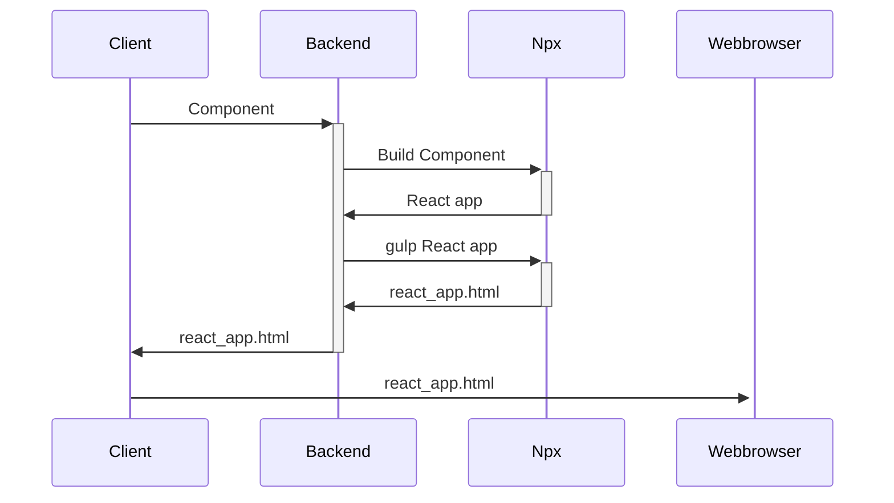
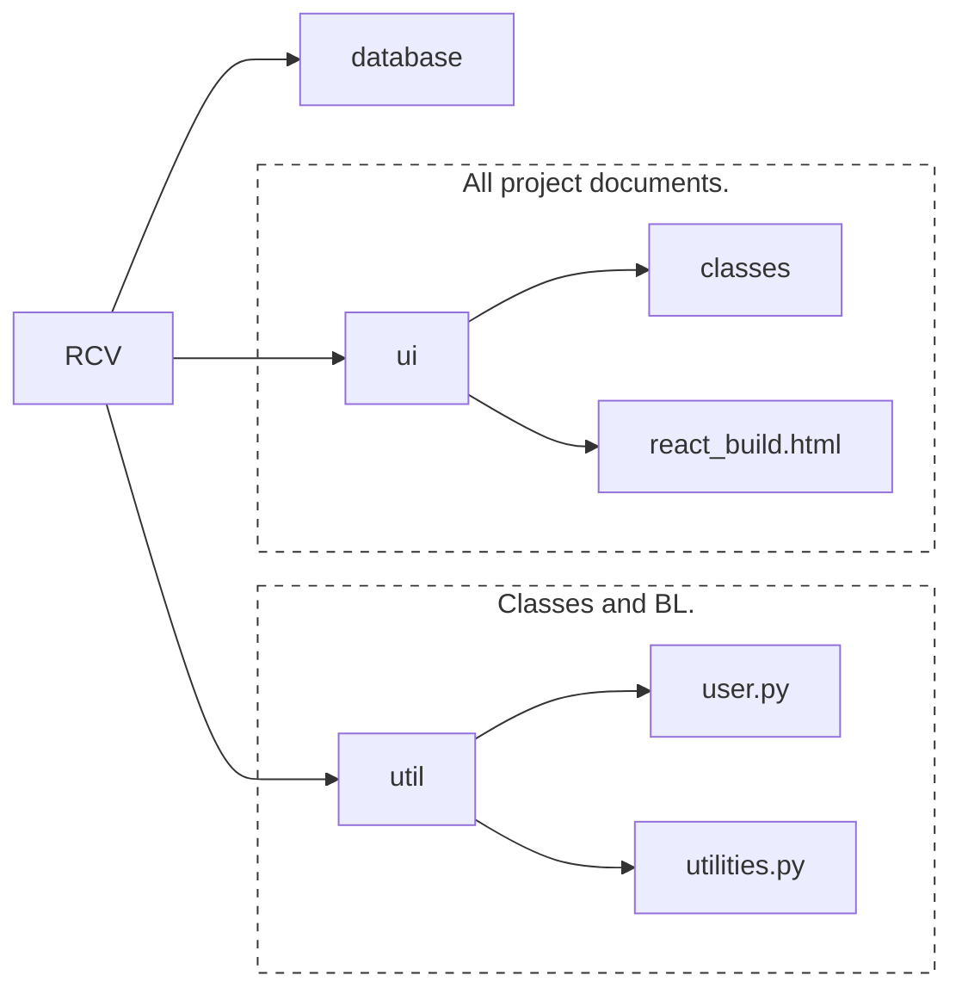
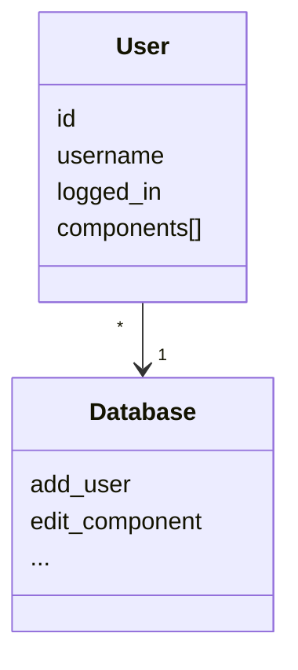
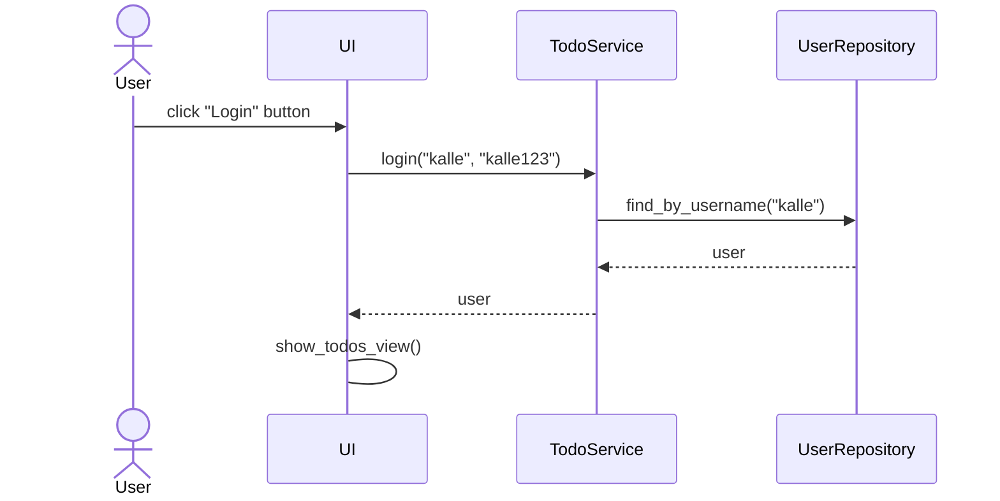
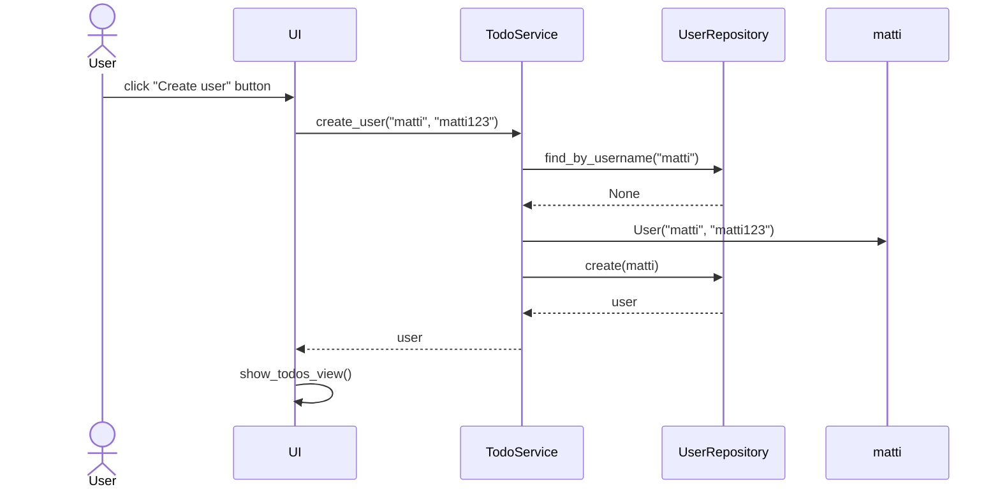
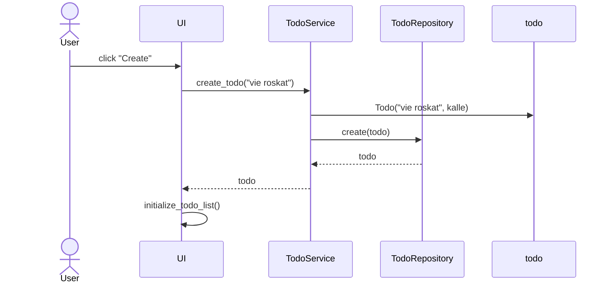

# UML

## Sequence diagram



# Arkkitehtuurikuvaus

## Composition

ReactComponentViewer is composed of three main layers



The ui package contains the frames (omitting the main frame, which is initialized in index.py). Utilities contain business logic, utility functions and the user class. The singular database.py file contains all interactions with the database (sqlite3).

## UI

The UI consists of three main screens:

- Log in / Register
- Your component / community components
- Add new component

Each of the scenes have been implemented as a separate class. The UI layer only implements the functions essential to its appearance. Logic has been isolated to the application layer.

## Application logic

RCV only has a single model for data storing, the user class. Data such as the components are stored in an array as raw data. Component adding, patching and deleting is implemented in the database class.



The most essential function in RCV is the render_component function, which requests the backend to build the given component into a react application. Most of the UI functionality is implemented within the scene classes whereas the backend connections are managed in [utilities.py](https://github.com/ni-eminen/ReactComponentViewer/blob/main/ReactComponentViewer/src/util/utilities.py) and [database.py](https://github.com/ni-eminen/ReactComponentViewer/blob/main/ReactComponentViewer/src/database.py).

RCV class diagram:


## Data storing

RCV stores all component and user data in an sqlite database. All data storage related operations are performed in [database.py](https://github.com/ni-eminen/ReactComponentViewer/blob/main/ReactComponentViewer/src/database.py) via the SQLAlchemy ORM. Tables are automatically initialized on the launch of the application.

### Tiedostot

Sovellus tallettaa käyttäjien ja todojen tiedot erillisiin tiedostoihin.

Sovelluksen juureen sijoitettu [konfiguraatiotiedosto](./kayttoohje.md#konfiguraatiotiedosto) [.env](https://github.com/ohjelmistotekniikka-hy/python-todo-app/blob/master/.env) määrittelee tiedostojen nimet.

Sovellus tallettaa tehtävät CSV-tiedostoon seuraavassa formaatissa:

```
65eef813-330a-4714-887b-2bda4d744487;opiskele pythonia;1;kalle
5749b61f-f312-45ef-94a1-71a758feee2b;kirjoita dokumentaatio;0;matti
```

Eli tehtävän id, sisältö, tehtystatus (0 = ei tehty, 1 = on tehty) ja käyttäjän käyttäjätunnus. Kenttien arvot erotellaan puolipisteellä (;).

Käyttäjät tallennetaan SQLite-tietokannan tauluun `users`, joka alustetaan [initialize_database.py](https://github.com/ohjelmistotekniikka-hy/python-todo-app/blob/master/src/initialize_database.py)-tiedostossa.

## Päätoiminnallisuudet

Kuvataan seuraavaksi sovelluksen toimintalogiikka muutaman päätoiminnallisuuden osalta sekvenssikaaviona.

### Käyttäjän kirjaantuminen

Kun kirjautumisnäkymän syötekenttiin kirjoitetetataan käyttäjätunnus ja salasana, jonka jälkeen klikataan painiketta _Login_, etenee sovelluksen kontrolli seuraavasti:



Painikkeen painamiseen reagoiva [tapahtumankäsittelijä](https://github.com/ohjelmistotekniikka-hy/python-todo-app/blob/master/src/ui/login_view.py#L18) kutsuu sovelluslogiikan `TodoService` metodia [login](https://github.com/ohjelmistotekniikka-hy/python-todo-app/blob/master/src/services/todo_service.py#L87) antaen parametriksi käyttäjätunnuksen ja salasanan. Sovelluslogiikka selvittää `UserRepository`:n avulla onko käyttäjätunnus olemassa. Jos on, tarkastetaan täsmääkö salasanat. Jos salasanat täsmäävät, kirjautuminen onnistuu. Tämän seurauksena käyttöliittymä vaihtaa näkymäksi `TodosView`:n, eli sovelluksen varsinaisen päänäkymän ja renderöi näkymään kirjautuneen käyttäjän todot eli tekemättömät tehtävät.

### Uuden käyttäjän luominen

Kun uuden käyttäjän luomisnäkymässä on syötetty käyttäjätunnus, joka ei ole jo käytössä sekä salasana, jonka jälkeen klikataan painiketta "Create" etenee sovelluksen kontrolli seuraavasti:



[Tapahtumakäsittelijä](https://github.com/ohjelmistotekniikka-hy/python-todo-app/blob/master/src/ui/create_user_view.py#L18) kutsuu sovelluslogiikan metodia [create_user](https://github.com/ohjelmistotekniikka-hy/python-todo-app/blob/master/src/services/todo_service.py#L130) antaen parametriksi luotavan käyttäjän tiedot. Sovelluslogiikka selvittää `UserRepository`:n avulla onko käyttäjätunnus olemassa. Jos ei, eli uuden käyttäjän luominen on mahdollista, luo sovelluslogiikka `User`-olion ja tallettaa sen kutsumalla `UserRepository`:n metodia `create`. Tästä seurauksena on se, että käyttöliittymä vaihtaa näkymäksi `TodosView`:n. Luotu käyttäjä kirjataan automaattisesti sisään.

### Todon luominen

Uuden todon luovan "Create"-painikkeen klikkaamisen jälkeen sovelluksen kontrolli eteneeseuraavasti:



[Tapahtumakäsittelijä](https://github.com/ohjelmistotekniikka-hy/python-todo-app/blob/master/src/ui/todos_view.py#L106) kutsuu sovelluslogiikan metodia [create_todo](https://github.com/ohjelmistotekniikka-hy/python-todo-app/blob/master/src/services/todo_service.py#L49) antaen parametriksi luotavan työn tiedot. Sovelluslogiikka luo uuden `Todo`-olion ja tallettaa sen kutsumalla `TodoRepository`:n metodia `create`. Tästä seurauksena on se, että käyttöliittymä päivittää näytettävät todot kutsumalla omaa metodiaan `initialize_todo_list`.

### Muut toiminnallisuudet

Sama periaate toistoo sovelluksen kaikissa toiminnallisuuksissa, käyttöliittymän tapahtumakäsittelijä kutsuu sopivaa sovelluslogiikan metodia, sovelluslogiikka päivittää todojen tai kirjautuneen käyttäjän tilaa. Kontrollin palatessa käyttäliittymään, päivitetään tarvittaessa todojen lista sekä aktiivinen näkyvä.

## Ohjelman rakenteeseen jääneet heikkoudet

### Käyttöliittymä

Graafisen käyttöliittymän koodissa on jonkin verran toisteisuuttaa, josta voisi toteuttaa omia komponenttejaan. Esimerkiksi pylint ilmoittaa toisteisesta koodista luokissa [CreateUserview](https://github.com/ohjelmistotekniikka-hy/python-todo-app/blob/master/src/ui/create_user_view.py) ja [LoginView](https://github.com/ohjelmistotekniikka-hy/python-todo-app/blob/master/src/ui/login_view.py).
