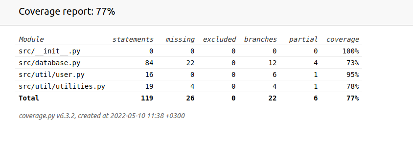

# Testing of ReactComponentViewer

ReactComponentViewer has been tested on both unit and integration levels. Test coverage for the project is high at almost 80 % test coverage omitting the UI. Tests have been designed to highlight issues in the backend and database layers on top of the local functionality.

## Yksikkö- ja integraatiotestaus

### Database

The database is the most crucial test subject. It is being tested through the [database_test.py](https://github.com/ni-eminen/ReactComponentViewer/blob/main/ReactComponentViewer/src/tests/database_test.py) class, which creates a mock database utilizing the [database class](https://github.com/ni-eminen/ReactComponentViewer/blob/1673ee6c6c06e25db945c7dd3fba257648143737/ReactComponentViewer/src/database.py#L10). A test user is added before testing. Crucial functions such as adding and deleting of users and components is tested among other things.

### Utilities

Utilities are the two most important function of this project. They are tested in [util_test.py](https://github.com/ni-eminen/ReactComponentViewer/blob/main/ReactComponentViewer/src/tests/util_test.py). The most important one being render_component. render_component sends the user-written React component to the back-end, which then builds it into an actual React application that is then bundled into a single HTML file and returned. A delicate process, which can be tested by querying if the returned file is indeed an HTML file by doctype. The test itself is very short and can be found [here](https://github.com/ni-eminen/ReactComponentViewer/blob/1673ee6c6c06e25db945c7dd3fba257648143737/ReactComponentViewer/src/tests/util_test.py#L12).

### User class testing

The user class is responsible for keeping track of the user that is logged on to the present session. The class is tested for its most essential methods such as user name changes and patching of components locally. The tests can be found in the [user_test.py](https://github.com/ni-eminen/ReactComponentViewer/blob/main/ReactComponentViewer/src/tests/user_test.py) file.

### Test coverage

Omitting the UI layer, test coverage is high at near 80 % coverage.

The database class could be tested further if deemed necessary.

## UI testing

UI is tested manually as there are not many good testing libraries for testing tkinter UI's. Tkinter asynchronous handling of callbacks also makes for some adverse testing environments.

### Installation and configuration

The software is test ready after installation as described in the [instructions](https://github.com/ni-eminen/ReactComponentViewer/blob/main/documentation/instructions.md).

Tests can be run regardless of database state or other user inflicted changes.

### Features

All the [features](https://github.com/ni-eminen/ReactComponentViewer/blob/main/documentation/vaatimusmaarittely.md) have been tested with both good and bad inputs such as non-existant users and bad components.
